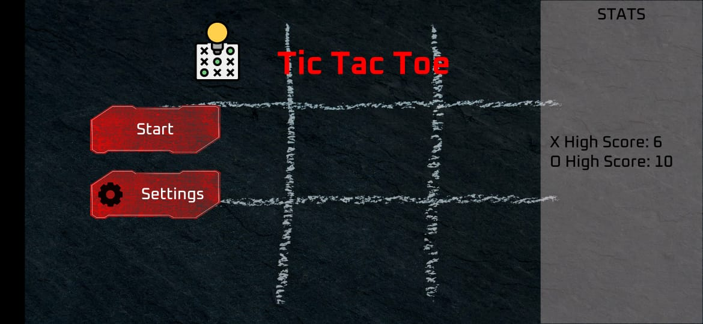
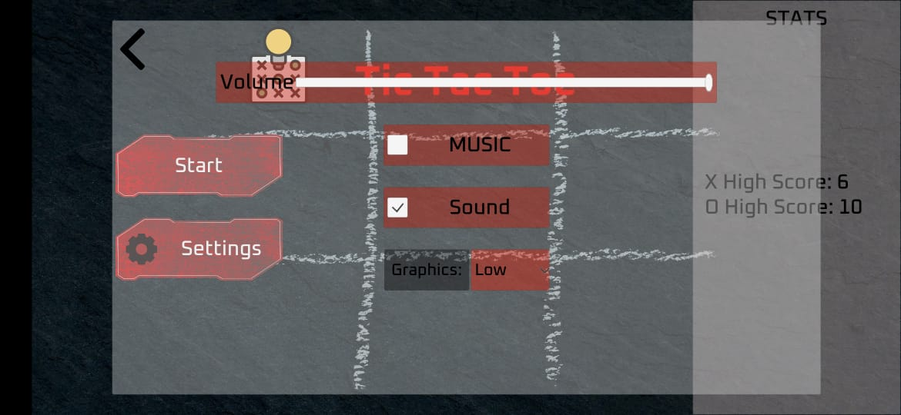
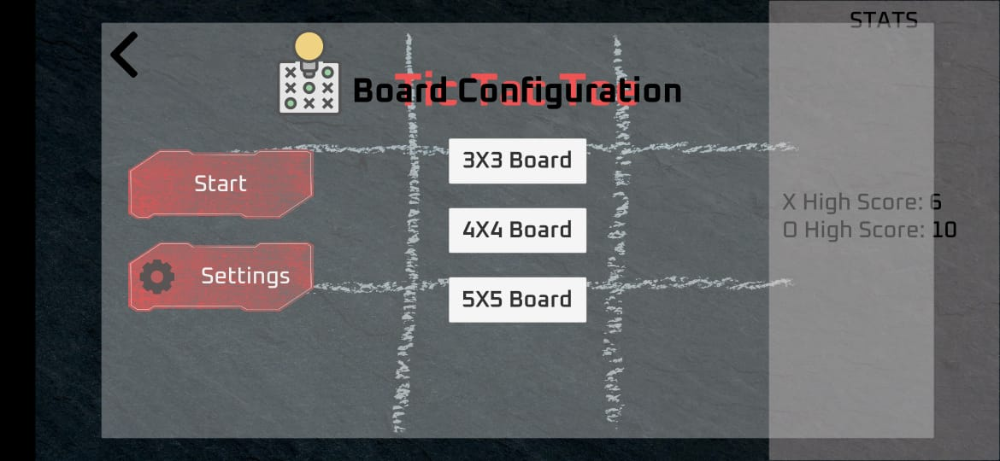
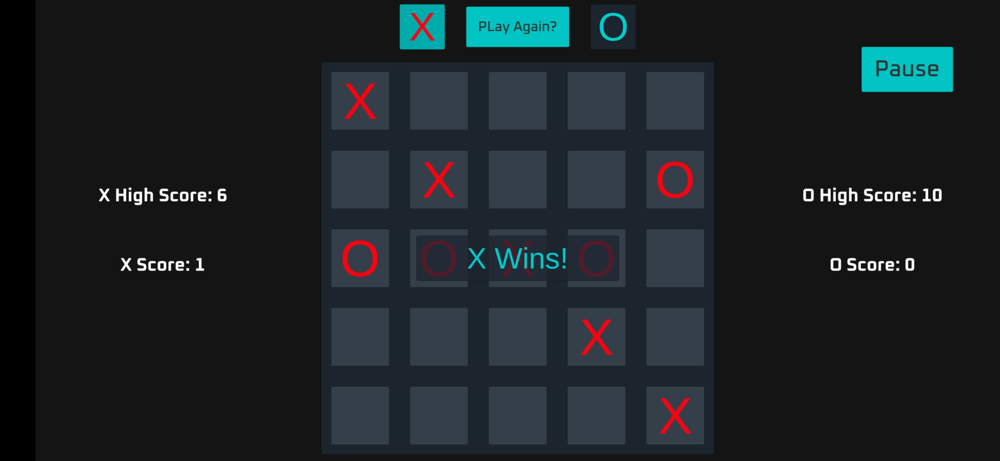
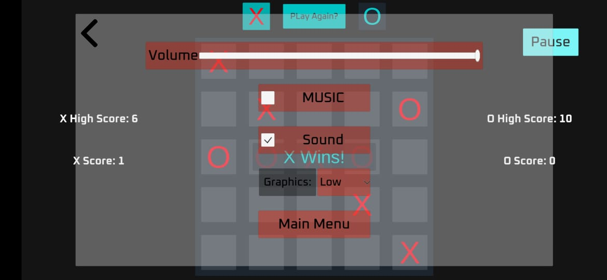

# TicTacToe
Created as an Internship task.
#
# *APK:*
https://github.com/SKY-ROY/TicTacToe/raw/master/Builds/Android/TicTacToe.apk
#

# *Screenshots:*
Main menu: 

Settings:

Board configuration:

Gameplay scene:

Pause menu:

#

# *Classes Used:*
TextFields
SaveSystem
StateData
CurrentScreenController
GlobalSettingsControl
LevelLoader
StatsControl
GameController_PvAI
GridSpace
LoadAssetBundles
#

# *The functioning of the Classes:*

*TextFields:*
This class is used to display various data values on-screen during a gameplay session bu taking them from the GlobalSettingsControl and GameController_PvAI class instances. All the data is shown in text format utilizing Unity’s inbuilt text UIElements. Variables shown are xScore, oScore, xHighScore, oHighScore.

*SaveSystem:*
This class is used to carry out the string to binary format conversion and vice versa of the data stored in StateData instances. This conversion is done to store the data values into a binary file and load these values in the next game session, and cross scene reference of global parameters. Such that player progress is persistent through the application lifecycle and scene changes.

*StateData:*
This class basically holds the data values of various types that govern the state of a game session. The parameterized constructor used here is responsible for assigning values to these local variables from the GlobalSettingsControl class.

*CurrentScreenController:*
This script is used to enable and disable screen panels(pause, settings, board configuration) in the respective scenes through event handlers in the editor.

*GlobalSettingsControl:*
This class is basically responsible for managing all the game sessions state-changing variables like volume, music, visual quality, sound effects, etc. All these values are saved into the binary file when they are changed through event handler methods. Similarly, all the values are loaded after a change from the same binary file and at the beginning of a game session.

*LevelLoader:*
This is a basic script employing the LoadSceneAsynchronously() method for loading screen display and changing through various board configurations through event handler in the editor.

*StatsControl:*
Similar to TextFields class this class displays the xHighScore and oHighscore on the start screen. Working in this script is the same as that of TextFields with some minor changes.

*GameControl_PvAI:*
This class handles all the game controls like clicking of a cell in the board and checking win condition after every move, the functioning of AI, incrementing score of each side and saving/updating them, changing colors of the cells based on the current playing side, etc.

*GridSpace:*
This class is instantiated on every grid cell and it handles whether the cell is marked or not and based on that cell’s interactivity is disabled.

*LoadAssetBundles:*
This class is responsible for loading assets from the asset bundles based on the directory specified which varies by the target platform. The loaded assets are then instantiated properly into their respective places.

`To fully test this feature:`
First, go to the Unity Editor and in there locate “Assets\Prefabs\AssetBundle Prefabs”.
There’s a prefab named ”GameTitle”, use this prefab to create an asset bundle by clicking Assets>Build AssetBundles at the top-left of the editor window. 
Clicking this will create an AssetBundle with the GameTitle prefab in it and then this prefab can be loaded from created AssetBundle when we play the game. 
On Play mode we see the Icon and Title of the game loaded at runtime through asset bundles.

Further Code Analysis and explanation is given in the code through comments and summaries.
#
